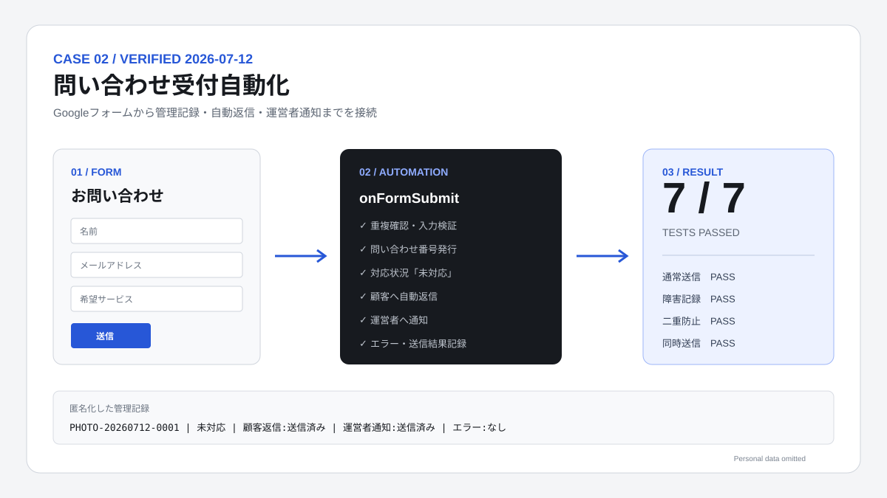

# 出張撮影サービス向け・問い合わせ受付自動化システム

架空の出張撮影サービス「Sunny Day Photo」向けに、問い合わせ受付から記録、自動返信、運営者通知までを自動化するポートフォリオ作品です。

[匿名化した検証証跡を見る](./EVIDENCE.md)

## 実装内容

- Googleフォームで問い合わせを受け付ける
- Googleスプレッドシートへ回答と処理結果を保存する
- `PHOTO-YYYYMMDD-0001` 形式の問い合わせ番号を発行する
- 対応状況を「未対応」で登録する
- 顧客へ受付完了メールを1通送る
- 運営者へ新規問い合わせ通知を1通送る
- 顧客メール・運営者通知の成否とエラーを記録する
- Googleフォームの回答IDを処理キーにして、同じ回答の再処理・二重送信を防ぐ
- `LockService` で同時送信時の番号重複を防ぐ

## 使用技術

- Google Forms
- Google Sheets
- Google Apps Script（V8）
- MailApp
- GitHub

## 管理シート

| 列 | 項目 | 内容 |
|---|---|---|
| A | 受付日時 | フォーム送信日時 |
| B | 問い合わせ番号 | 自動発行する識別番号 |
| C | 名前 | 顧客名 |
| D | メールアドレス | 返信先 |
| E | 希望サービス | 3種類から選択 |
| F | 希望日 | 任意入力 |
| G | 問い合わせ内容 | 顧客の質問・要望 |
| H | 対応状況 | 初期値は「未対応」 |
| I | 返信状況 | 未送信・送信済み・送信失敗 |
| J | エラー | メール送信等のエラー内容 |
| K | 運営者通知状況 | 内部管理用・通常は非表示 |
| L | 処理キー | 二重送信防止用・通常は非表示 |

## 初回セットアップ

1. 対象の問い合わせ管理スプレッドシートを開く。
2. `設定` シートの「運営者通知先」を確認する。
3. 上部メニューの「拡張機能」→「Apps Script」を開く。
4. `Code.gs` の内容を貼り付ける。
5. プロジェクトの設定でマニフェストを表示し、`appsscript.json` の内容を反映する。
6. 関数一覧から `setupSystem` を選び、1回だけ実行する。
7. Googleフォーム・スプレッドシート・メール送信・トリガー作成の権限を許可する。
8. 実行ログに表示される `formUrl` を開き、テスト送信する。

`setupSystem` は、実行元スプレッドシートのIDを非公開のスクリプトプロパティに保存し、フォーム作成、回答先との接続、フォーム送信トリガーの登録をまとめて行います。再実行時は設定済みのフォームを再利用し、トリガーだけを1つに整理します。

## フォーム項目

| 項目 | 必須 | 種類 |
|---|---:|---|
| 名前 | 必須 | 1行テキスト |
| メールアドレス | 必須 | メール形式検証付きテキスト |
| 希望サービス | 必須 | 3択 |
| 希望日 | 任意 | 日付 |
| 問い合わせ内容 | 必須 | 段落テキスト |

希望サービスの選択肢：

- 個人プロフィール撮影
- 家族・記念撮影
- イベント撮影

## 運用

- 顧客への案内には `設定` シートの「公開フォームURL」を使う。
- 運営者は `問い合わせ一覧` の「対応状況」を更新する。
- エラーがある場合は「返信状況」「エラー」「運営者通知状況」を確認する。
- コード変更後は `runSelfCheck` を実行し、構成上の問題がないことを確認する。

## 二重送信防止

フォーム回答ごとの不変な回答IDを処理キーとしてL列へ保存します。送信処理の開始前に同じ処理キーが存在するかを確認し、存在する場合は処理全体を終了します。さらにスクリプトロックを使い、同時実行による番号重複と競合を抑止します。

## 実機テスト結果

2026年7月12日に架空データのみを使って実機テストを行い、7項目すべてが合格しました。完成条件の「5種類以上」を満たしています。

- 必須項目のみ：合格
- 全項目入力：合格
- 3種類のサービス選択肢：合格
- 不正メール形式の拒否：合格
- 障害注入時の送信失敗・エラー記録：合格
- 二重送信防止：合格
- 1秒差の短時間送信：合格

短時間送信では2件を1秒差で送信し、重複しない問い合わせ番号が発行され、各回答が1回ずつ処理されました。二重送信防止テストでは、同じ回答IDの再処理時に管理行とメール処理が増えないことを確認しました。メール失敗テストではMailAppを呼ぶ前に安全な障害注入を行い、実メールを送らずに顧客返信・運営者通知が「送信失敗」となり、両方のエラー内容が記録されることを確認しました。

## 制限事項

- 初回のコード貼り付けとGoogle権限の許可は、所有者本人の操作が必要です。
- Google Apps Script／MailAppの1日あたりの割り当て上限に従います。
- メール送信とシート更新をまたぐ完全な分散トランザクションはありません。通常の再実行では回答IDにより二重送信を防止しますが、メール送信直後かつ状態記録直前に実行基盤が強制終了した場合までは完全保証できません。
- 本作品では予約確定、決済、カレンダー登録、AI回答、高度な管理画面は対象外です。

## ファイル

- `Code.gs`：フォーム作成、受付処理、メール送信、二重送信防止
- `appsscript.json`：タイムゾーン、V8ランタイム、権限設定
- `TEST_PLAN.md`：テスト項目と合格基準
